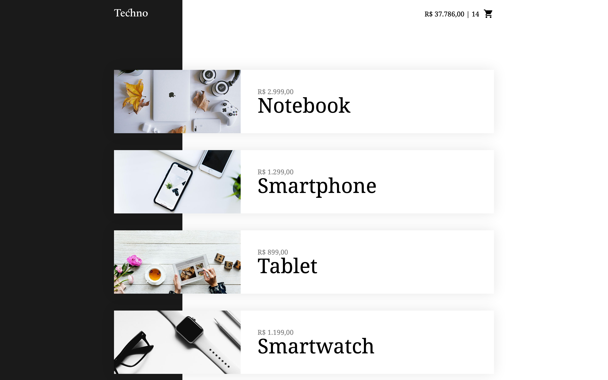

# Techno Vue

 

## Introduction 

Project developed with vue without component concepts just by opening an instance of Vue and using the html itself to make changes to the DOM.

## Usage

Just clone the repository and open the `index.html`.

